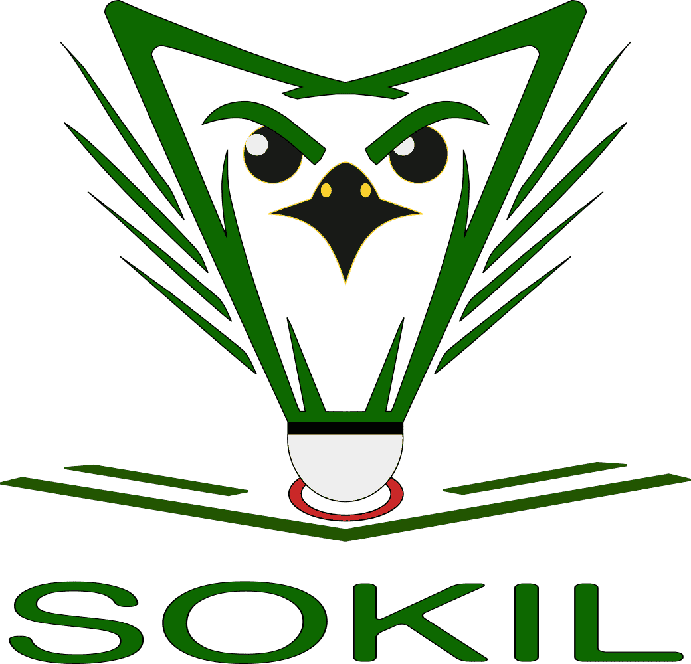
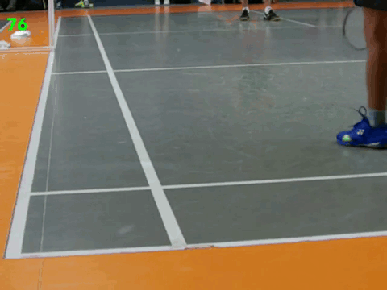

# 🐦 Sokil

A monocular computer-vision system to make badminton line calls.

`Sokil` is the Ukrainian word for `falcon`, a bird that can see up to ~129 frames per second.

## Demo

Here's a short demo of `Sokil` for singles court boundaries

You can see a full video explaining each stage of the analysis [here](./assets/demo.mp4)

## 💡 Motivation

Traditional instant review systems used in professional tournaments require multiple expensive synchronized high-speed cameras, days of setup, and lots of training data. Besides, these systems are closed-source, so you can't run them anyway.

For small clubs and tournaments at both amature and lower-level professional tournaments, this isn't an option.

However, if there were a system that could serve as an assistance tool to the umpire to make line calls as well as run on relatively inexpensive hardware, it would allow making the game fairer.

This is what `Sokil` aims to solve.

## 📘 Preparation

Before using the system you need to perform these steps:

1. Set up the camera in your hall and record a few dozen clips.
Refer to [./docs/camera-setup.md](./docs/camera-setup.md) for more details.

2. Train the court and shuttle models per [./docs/training.md](./docs/training.md).

## ⚒️ Usage

You can run `Sokil` either as a Python package on your local system or as a process in a Docker container.

Refer to [./docs/usage.md](./docs/usage.md) for more details.

## ✨ Features

- [x] Court segmentation
- [x] Shuttle detection
- [x] Cork detection
- [x] Hit detection
- [x] Visual explanation
- [x] Docker image
- [x] Training
- [x] Camera calibration
- [x] CLI

## Limitations

- The tool doesn't differentiate between multiple shuttles.
- Currently, the project provides only CLI which is not ideal for non-technical folks.
- Static camera is required. Court is solved once, if the camera shakes or moves mid-clip, the result will be inaccurate.
- Due to the use of `ultralytics` in this project, if you fork it, you must use `AGPL-3.0` as well as open source the code to use it commerically. See [LICENSE](./LICENSE) for more details.

## License

`AGPL-3.0` inherited from [Ultralytics](https://github.com/ultralytics/ultralytics).

## Attribution

The project is greatly inspired by the wonderful [article](https://spyro-soft.com/blog/artificial-intelligence-machine-learning/instant-review-system-for-badminton-computer-vision-use-case) by `Spyrosoft`.
