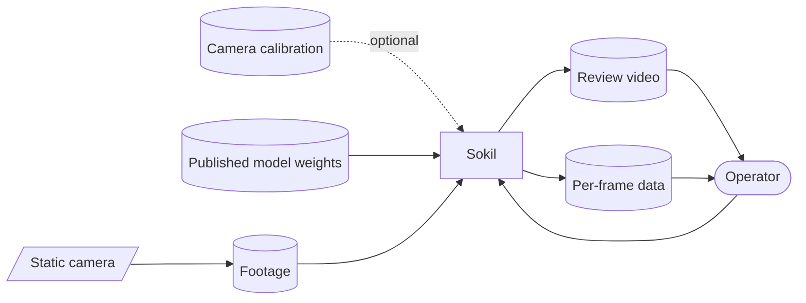
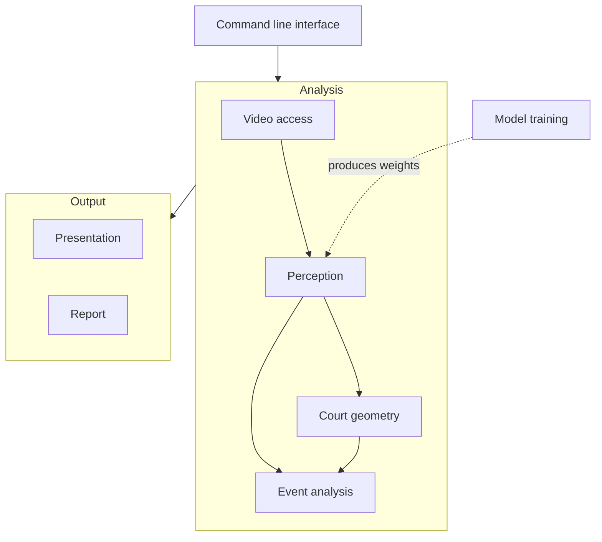
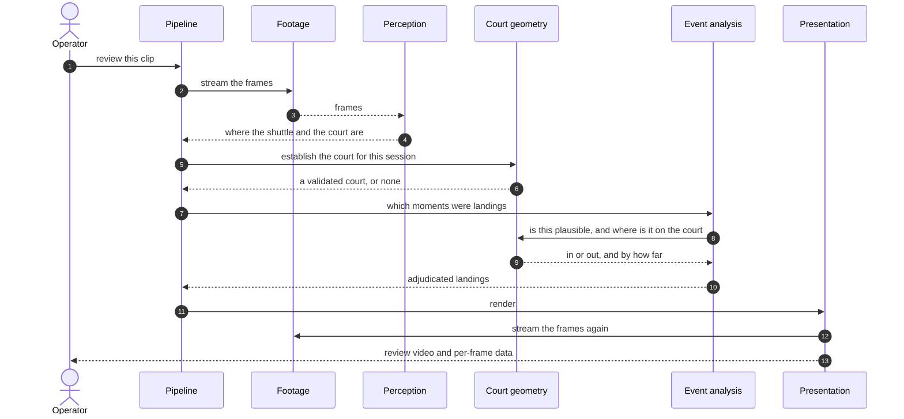
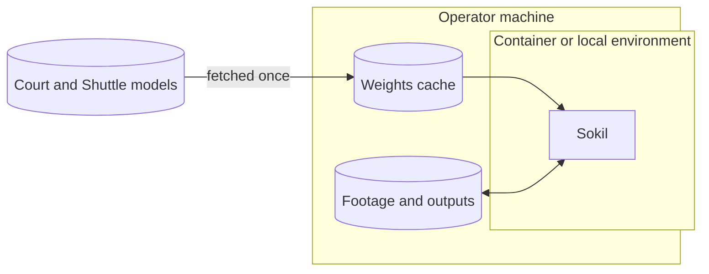

# Architecture

The document describes the high-level architecture of `Sokil`.

## 1. Introduction

The goal is to design a monocular system with the following features:
- Court segmentation
- Shuttle tracking
- Floor hit event identification
- Precise landing position estimation

## 2. Constraints

| Constraint | Consequence |
|---|---|
| A single camera, no depth information | Every spatial claim is recovered by knowing the real dimensions of the court. The court is the measuring stick. |
| Static camera | The image-to-court mapping is a property of the session, not of a frame. |
| One court in view | Multi-court and moving-camera use are out of scope. |
| CPU-first | Efficient model inference that may run on consumer hardware without expensive video cards. |
| Consumer footage | Motion blur, occlusion by players, and imperfect lighting are expected. |

## 3. Context and scope

| Interface | Direction | Notes |
|---|---|---|
| Footage | in | A recording from one fixed viewpoint |
| Camera calibration | in | Optional lens correction, measured once per camera |
| Model weights | in | Fetched from a published, pinned release and cached locally |
| Review video | out | The footage with the analysis drawn on it |
| Per-frame data | out | Measurements, for evaluation and tuning |

Everything runs locally. Nothing is uploaded, and the only network access is the
one-time weights download.

## 4. Building block view

| Block | Responsibility |
|---|---|
| **Command line interface** | Wiring and argument handling. No logic of its own. |
| **Video access** | The only component that touches the file. Decodes on demand and applies any correction, so every stage sees identical pixels. |
| **Perception** | Locates the shuttle and the court in a frame, reporting plain geometric shapes. The only component aware of a model framework. |
| **Court geometry** | Establishes and holds the mapping between image and court, and the regions a call is made against. Encodes what badminton is, and changes least. |
| **Event analysis** | Turns a sequence of observations into landings, and each landing into a verdict. |
| **Presentation** | The review video and the per-stage debugging views. Purely downstream: deleting it would not change a verdict. |
| **Report** | Measurements exported for evaluation and tuning. |
| **Model training** | A separate lifecycle that produces the weights perception consumes. The two meet only at a file path. |

Dependencies point one way: presentation and reporting depend on analysis;
analysis depends on perception; perception knows nothing about courts.

## 5. Runtime view

### Clip Review Process

## 6. Deployment view

