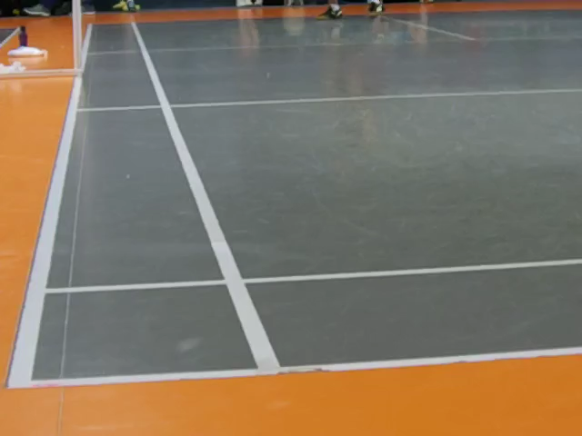

# Camera Setup

This document describes how to set up a camera to be used for further analysis by `Sokil`.

## Recommended Camera Specifications

It's best to use a computer-vision camera and the following specifications describe it. However, regular phone cameras will work but the accuracy will be suboptimal:

* Resolution: `640x480`. By default, inference is at 480p; therefore, recording at higher resolution is not needed.
* FPS: `120`. At a standard 24-30 FPS rate, the exact frame where the shuttle touches the ground is more likely to be lost due to the shuttle speed. Therefore, the more FPS the better, but the cost is slower inference speed.
* Shutter type: `global`. Unlike `rolling`, `global` shutter prevents geometric distortion and makes computer vision models more robust.
* Color channels: `1` -> `grayscale`. Monochrome cameras capture significantly more light; therefore images are much sharper and better for computer vision models.

## Placement

- The camera has to be static the entire duration of the clip to reliably detect court edges and shuttle cork.
- To achieve the best accuracy, the camera should be pointed at a single corridor. Recording the whole court or multiple lines causes parallax and therefore, a single camera cant't reliably tell where the shuttle landed.



## Calibration

To remove image distortion and measure court size more accurately, it's advised to calibrate the camera at the same lens and zoom settings as in the video recordings.

Calibration is per camera and per lens setting: repeat it after changing the lens or the zoom, but not after moving the camera.

### 1. Record a checkerboard

Print a checkerboard, keep it flat, and record a short clip of it held at many different angles, distances and positions in the frame, including near the corners. Refer to [this guide](https://docs.opencv.org/4.13.0/dc/dbb/tutorial_py_calibration.html) for examples.

### 2. Collect frames

```bash
uv run sokil calibrate frames --video-path checkerboard.mp4 --output-path calibration_images
```

Diverse frames are chosen automatically by default. If you are not satisfied with the calibration result and would like to select frames manually, add `--interactive` to the command.

> [!NOTE]  
> Interactive selection won't work from the Docker container.

### 3. Solve

```bash
uv run sokil calibrate compute --images-path calibration_images --output-path artifacts
```

The command will automatically find what board size can be used for calibration and report the reprojection error.

### 4. Use it

```bash
uv run sokil review --video-path clip.mp4 --output-path review.mp4 \
    --camera-intrinsics-path artifacts/camera_K.npy \
    --camera-dist-path artifacts/camera_dist.npy
```
