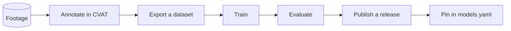

# Training and publishing models

Sokil uses two trained models:
- Shuttle detector
- Court segmenter

This document covers the process of training them and publishing.

## Lifecycle



## 1. Annotate

We use [CVAT](https://www.cvat.ai/) for annotation. To bring it up, run this:

```bash
make cvat-up
make cvat-superuser        # first time only
```

Then, create a task from your videos:

```bash
uv run sokil create-cvat-task --video-path clip.mp4 --model shuttle # run --help to see available options
```

See [../infra/README.md](../infra/README.md) for running CVAT itself.

## 2. Export a dataset

Once the tasks are marked complete in CVAT:

```bash
uv run sokil export-cvat-dataset --model shuttle
```

This pulls the completed tasks and writes a dataset under `training/<model>/`, splitting it into train, validation and test. Frames are converted to the expected model format, e.g. `grayscale`.

## 3. Train

```bash
uv run sokil train-model --model shuttle
```

Per-model defaults come from `sokil/training/training.yaml`.

## 4. Evaluate

For now, the evaluation dataset is not published. Therefore, the best you can do is run a review using the trained model.

```bash
uv run sokil review --video-path clip.mp4 --output-path new.mp4 \
    --shuttle-detector-model-path runs/detect/train8/weights/best.pt
```

---

> [!NOTE]  
> The following steps are for project maintainers.

## 5. Publish and pin

**Publish the release.** The weights are uploaded under the asset names the manifest expects:

```bash
make models-release MODELS_TAG=models-2026-09-06 \
    SHUTTLE_WEIGHTS=runs/detect/train/weights/best.pt \
    COURT_WEIGHTS=runs/segment/train/weights/best.pt
```

**Pin them in the manifest.** This computes the checksums and prints the
manifest entries:

```bash
uv run sokil models pin --tag models-2026-09-06 \
    --weights shuttle=runs/detect/train/weights/best.pt \
    --weights court=runs/segment/train/weights/best.pt
```

Paste the output into `sokil/models.yaml`, keeping its comments, and commit it.

## Versioning

`sokil/models.yaml` is the single source of truth for which weights a given
commit expects. Nothing discovers a version at runtime.

| Field | Meaning |
|---|---|
| `version` | Human-facing label, dated `YYYY-MM-DD`. Make sure to quote it so that YAML parses it as a string. |
| `release_tag` | The release carrying the asset, `models-<version>` by convention. |
| `asset` | The published file name. |
| `sha256` | The checksum. |
| `expects` | What the weights were trained to be fed: image size, grayscale, class names. |

## Model Precedence Order

1. Command line argument.
2. `SOKIL_MODELS_DIR`, if set.
3. The checkout's own `models/` directory — useful for trying weights you have just trained, before publishing anything.
4. The download cache, keyed by version.
5. Otherwise the pinned release is downloaded. If that fails, the run fails.

```bash
uv run sokil models path     # reports what each model currently resolves to
uv run sokil models download # pre-fetches all models
```
